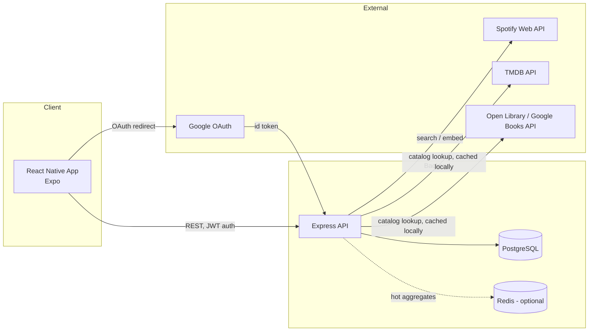
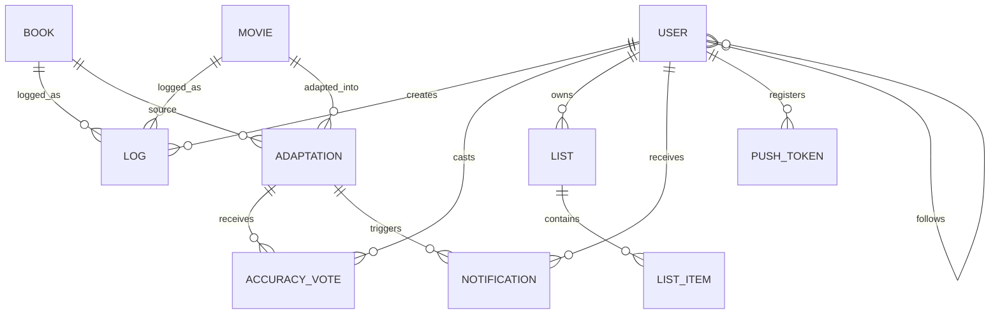

# PageToScreen — Design Document

*(working title — swap for whatever name you land on)*

A mobile app for logging books and movies, in the style of Letterboxd/Goodreads, with a core differentiator: users vote on how accurately a movie adapted the book it's based on.

---

## 1. Overview

Letterboxd and Goodreads each do one medium well, but neither captures the relationship between a book and its adaptation. PageToScreen treats "book → movie" as a first-class object: every adaptation gets its own page with an aggregate, crowd-voted accuracy score, on top of standard logging, rating, and reviewing for books and movies individually.

## 2. Target Users

- People who read the book before watching the adaptation (or vice versa) and want to compare
- Letterboxd/Goodreads users who want one app instead of two
- Casual users who just want to log what they've read/watched, with adaptation features as a bonus, not a requirement

## 3. Feature Set

### 3.1 Core Features (from the brief)

| Feature | Notes |
|---|---|
| Google Sign-In | OAuth via Google; JWT session issued by our backend afterward |
| Scrollable feed | Infinite-scroll home feed — recent logs/votes from people you follow, or trending adaptations |
| Log any book or movie | Independent of the adaptation feature — logging a book with no film version works the same |
| Accuracy voting (stars) | Per-adaptation, 1–5 stars, one vote per user, averaged and shown publicly |
| Multi-user voting | The average/aggregate is the point — a single vote is just one data point |
| Spotify soundtrack link | Each movie can show its official soundtrack, playable in-app |
| Rate books & movies | Separate from accuracy voting — this is "did I like it," not "was it faithful" |
| Recommendations | Suggest books/movies based on your logging and rating history |

### 3.2 The Differentiator: Adaptation Accuracy

This is the feature an employer will ask about, so it's worth designing carefully:

- An **Adaptation** is a proper **many-to-many join** between `Book` and `Movie`, not a 1:1 pairing: a book can have multiple film versions (remakes), *and* a movie can draw on multiple source books (e.g. a film that pulls from several novels in a series, or several short stories) — each book↔movie pair is its own `Adaptation` row with its own independent accuracy score. A movie with two source books simply has two `Adaptation` rows, and can be more faithful to one than the other.
- Anyone can **suggest** a new adaptation link; it starts as `unapproved`/pending, and is shown in the UI with a **"pending" badge** rather than being hidden — so early adopters can still discover and vote on it.
- **Approval is automatic, not manual:** an adaptation flips from pending to approved once **100 distinct users** have cast an accuracy vote on it. Votes are already one-per-user (enforced by the `userId + adaptationId` unique constraint), so hitting 100 means 100 different people, not one person voting repeatedly — a decent (not perfect) signal that the link is real, without needing an admin to manually review every submission. This is a nicer story for a solo CV project than "I built a moderation queue and I'm the only moderator."
- The flip is **one-directional** — once `approved` becomes `true` it stays `true`, even if later activity looks different. Treat it as a ratchet, not a live status.
- Votes are **1–5 stars, one per user per adaptation**, enforced with a DB unique constraint (`userId + adaptationId`) — re-voting updates your existing vote rather than creating a duplicate.
- The aggregate score is computed on read (`AVG(score)`), not stored redundantly — simpler, and fine at moderate scale. (Noted as a caching candidate later.)
- **Known trade-off, worth stating up front if asked:** the vote-count threshold is a cold-start problem for niche books — an obscure book's adaptation might take a long time to reach 100 voters even if the link is obviously correct. A cheap mitigation without building a full moderation system: let a handful of trusted/early users (or just you, as the sole "admin" during development) manually flag a submission as approved early, as an escape hatch rather than the primary path.

### 3.3 Suggested Additions (not in your original list)

A few features that would round the project out and give you more to talk about in interviews, without inflating scope too much:

- **"Wrapped"-style yearly stats page** (detailed in §7.6) — books read, movies watched, average accuracy score you gave adaptations, your most-logged genre, etc. Purely a read-heavy aggregation feature, but it's the single best-looking screen in a Letterboxd-style app and shows off data visualization (charts, not just lists).
- **Adaptation leaderboard** — a global "Most Faithful Adaptations" / "Biggest Letdowns" ranking. This is almost free once voting exists (`ORDER BY averageScore`), and it's the most shareable, screenshot-able screen in the app.
- **Notifications for logged books** (detailed in §7.7) — "A new movie adaptation of *[book you logged]* was just added." Ties your existing data (logs) to new data (adaptations) in a way that feels personal, and it's a good excuse to build a simple notification system.
- **Lightweight social layer** — follow users, see their activity in your feed, comment on reviews. You already have `follows` in the schema; this just exposes it in the UI.
- **A small admin/moderation web dashboard** — since approval is now automatic (see §3.2), this isn't for routine approvals; it's for pulling obviously wrong or spam submissions out of the pending queue before they ever reach real users, and as a manual override for the cold-start case on niche books. Still a legitimate reason to spin up a second, small Next.js app that talks to the same API — a good "I built a full-stack system with multiple clients" story instead of a single React Native app in isolation.

### 3.4 Engineering Practices Worth Showcasing

These aren't user-facing features, but they're what separates a "school project" README from a "this person can ship" one:

- Automated tests (unit tests on services, integration tests on key endpoints)
- CI pipeline (GitHub Actions: lint + test on every PR)
- API documentation (OpenAPI/Swagger — either hand-written spec or generated via `tsoa`/`swagger-jsdoc` annotations on route files)
- Rate limiting on write endpoints (`express-rate-limit` or `rate-limiter-flexible`) — relevant precisely because voting is a write endpoint someone could spam
- A caching layer (Redis) for hot aggregates — adaptation accuracy averages and the leaderboard are the obvious candidates
- Basic error tracking (Sentry free tier) once the app is live somewhere

## 4. System Architecture



Books and movies aren't stored with full metadata from day one — the API queries TMDB/Open Library on first lookup and caches the result locally (title, cover, year, etc.), so your own DB stays the source of truth for anything user-generated (logs, votes, ratings) while external APIs stay the source of truth for catalog data.

## 5. Data Model

Core entities (full Prisma schema already written separately):



## 6. Tech Stack

| Layer | Choice | Why |
|---|---|---|
| Mobile | React Native + Expo (TypeScript) | One codebase, iOS + Android, fast iteration |
| Backend | Express + TypeScript | Minimal, unopinionated, widely used — you control the structure (routes → controllers → services) |
| ORM / DB | Prisma + PostgreSQL | Type-safe queries, easy migrations |
| Auth | Google OAuth (sign-in) + custom JWT (session) | Standard pattern, avoids storing passwords for most users |
| Caching | Redis (optional, phase 2) | Hot aggregates: accuracy averages, leaderboard |
| Deployment | Railway/Render (API), EAS Build (mobile) | Free/cheap tiers, real public URLs for a demo |
| CI | GitHub Actions | Lint + test on every push |

## 7. Key Flows

### 7.1 Google Sign-In

1. Mobile app triggers Google's OAuth flow (via `expo-auth-session` or `@react-native-google-signin/google-signin`).
2. Google returns an ID token to the app.
3. App sends that ID token to `POST /auth/google` on our API.
4. API verifies the token with Google, finds-or-creates a `User` record, and issues our own access + refresh JWT pair.
5. From here on, the app behaves exactly like the JWT auth already designed — Google is only involved at login.

### 7.2 Logging a Book or Movie

Already built in the NestJS example: `POST /logs` with `mediaType`, the relevant `bookId`/`movieId`, optional `status`/`rating`/`review`.

### 7.3 Accuracy Voting

`GET /adaptations/:id` (public) returns the live average plus approval status: `approved`, `pending`, and `votesUntilApproval` (how many more distinct voters are needed) — enough for the client to render the "pending" badge and a "62/100 votes" progress indicator without a separate request.

`POST /adaptations/:id/votes` (authenticated, upsert-based) does two things in one request: records the vote, then checks whether the total distinct vote count has crossed 100 — if so, and the adaptation isn't already approved, it flips `approved` to `true`. That check-then-flip isn't perfectly atomic under heavy concurrent voting (two requests could both read "99 votes" before either writes), but at the scale a portfolio project sees that's a non-issue — worth knowing the theoretical gap exists (a DB-level trigger or transaction would close it) without spending time building for load you won't have.

### 7.4 Spotify Soundtrack

**Important — a real constraint, not just a design choice:** Spotify significantly tightened developer access in February 2026. New "Development Mode" apps are capped at 5 authorized test users, one Client ID per developer, and a Premium account is required for the developer registering the app. Getting past that cap ("Extended Quota Mode") requires an approval process aimed at apps with demonstrated commercial viability — not a great fit for a solo portfolio project. This changes the practical design:

- **Don't build against the authenticated Web API for this feature.** Fetching a track/album by search and rendering full metadata would work in Development Mode, but only for up to 5 logged-in test accounts — fine for your own testing, not for a public demo.
- **Use Spotify's embeddable player instead** (`open.spotify.com/embed/album/<id>` in an iframe/WebView, or the oEmbed endpoint). This doesn't require the same authenticated quota and works for any visitor: it gives a 30-second preview to users not logged into Spotify, and full playback via Spotify Connect for users who are.
- **Curate the book→soundtrack link manually or via the admin dashboard**, the same way adaptations are curated — search Spotify's catalog once, store the album/playlist URI on the `Movie` record, and just embed it. This sidesteps needing broad API scopes at runtime entirely.
- If you want to describe this in an interview: "I designed around a third-party platform's changing developer policy instead of assuming stable API access" is a genuinely good line — it shows you evaluate constraints before building, not just Wikipedia-style feature lists.

### 7.5 Recommendations

Two phases, deliberately scoped so you always have something working:

- **Phase 1 (content-based, no ML infra needed):** score unrated books/movies by overlap with genres/authors/directors the user has rated highly. A weighted tag-overlap score is enough to produce a believable "Because you liked X" row, and it's explainable — a plus when someone asks "how does this work?"
- **Phase 2 (collaborative, stretch goal):** basic user-item rating matrix, cosine similarity between users, or a lightweight matrix-factorization library. Positioned as a "future work" section is honest and still shows you understand the next step, even if you don't ship it.

### 7.6 Yearly "Wrapped" Stats Page

What it shows (all scoped to a given year, defaulting to the current one):

- Books logged / movies logged, split out
- Average rating you gave, books vs. movies
- Average accuracy score you've *voted*, across all adaptations you rated
- Your most-logged genre, author, and director
- **"Your most controversial vote"** — the adaptation where your accuracy score differed most from the crowd average. Small addition, but it's the one stat that feels personal rather than just a count, and it's a nice showcase of a slightly more interesting query (a `HAVING`/subquery comparing one row to an aggregate).
- A simple "reading/watching streak" if you want one more card

**Data source:** computed with Prisma `aggregate`/`groupBy` over `Log` and `AccuracyVote`, filtered by `userId` and a date range on `loggedAt`/`createdAt`. No new write-side tables are required for this to work.

**Caching strategy (cache-aside, worth mentioning in interviews):**
- For the *current*, still-changing year: compute live, no cache — data changes as the user logs things.
- For a *past, completed* year: the numbers are frozen, so compute once, cache the result (Redis, key `stats:{userId}:{year}`, no expiry needed since it can only go stale if you allow retroactive log edits — worth a one-line caveat either way).
- This gives you a legitimate "why did you cache this and not that" answer instead of caching everything by default.

**UI note:** this is the screen most worth polishing for a demo GIF/video — a swipeable, full-screen card-per-stat layout (Instagram Stories style, via `react-native-pager-view` + Reanimated) reads far better on a CV/portfolio page than a plain list of numbers.

**Endpoint:** `GET /users/:id/stats?year=2026`

### 7.7 Notifications for Logged Books

**Trigger:** whenever a new `Adaptation` is created (or moves from `unapproved` → `approved`, depending on how strict you want this), find every user who has logged the linked `Book` and notify them.

**Data model additions:**

```
Notification
  id           uuid
  userId       -> User
  type         enum (NEW_ADAPTATION, ...)
  adaptationId -> Adaptation (nullable, depends on type)
  read         boolean, default false
  createdAt    datetime
```

```
PushToken
  id        uuid
  userId    -> User
  token     string          // Expo push token for one device
  createdAt datetime
```

**Flow:**
1. Adaptation gets approved → query `Log` for distinct `userId`s where `bookId = adaptation.bookId` and `mediaType = BOOK`.
2. Create one `Notification` row per matched user.
3. For each of those users' registered `PushToken`s, send a push via **Expo's push notification service** — since the app is already built on Expo, this avoids configuring APNs/FCM certificates directly; you just POST token + message to Expo's push API and they handle delivery.
4. In-app: a notifications screen backed by `GET /notifications`, with `PATCH /notifications/:id/read` to mark as seen.

**Scale note (a good "phase 2 hardening" callout):** step 1–3 running synchronously inside the "approve adaptation" request is fine at portfolio-project scale, but is the natural place to introduce a background job queue (BullMQ + Redis) if a book ever has a large number of loggers — fan-out becomes a queued job instead of blocking the approval request. Worth stating as a known next step rather than building it prematurely.

## 8. Representative API Surface

```
POST   /auth/google              exchange Google ID token for our JWT pair
POST   /auth/refresh             refresh an expired access token

GET    /logs                     current user's logs
POST   /logs                     create a log (book or movie)
DELETE /logs/:id

GET    /adaptations/:id          adaptation detail + live accuracy average
POST   /adaptations/:id/votes    cast/update an accuracy vote
POST   /adaptations                submit a new book↔movie link (unapproved)

GET    /books/search?q=
GET    /movies/search?q=

GET    /recommendations          personalized feed

GET    /users/:id/stats?year=    yearly "wrapped" style aggregates (cached for past years)

GET    /notifications            current user's notifications
PATCH  /notifications/:id/read   mark one as read
POST   /users/me/push-token      register an Expo push token for this device
```

## 9. Non-Functional Requirements

- **Consistency over speed at small scale** — accuracy score computed live (`AVG`) is fine until it isn't; Redis caching is a documented upgrade path, not a day-one requirement.
- **Auth security** — short-lived access tokens, longer-lived refresh tokens, refresh tokens revocable server-side.
- **Abuse resistance** — rate-limit voting and log creation; one vote per user per adaptation enforced at the DB layer, not just the API layer.
- **Data provenance** — book/movie catalog data is cached from external APIs, not treated as user-owned; adaptation links are moderated before being public-facing.

## 10. Roadmap

*A phase-level summary — see `ROADMAP.md` for the step-by-step build order, including initial repo/environment setup.*

**MVP**
Google sign-in → log books/movies → rate them → adaptation pages with accuracy voting → basic feed.

**Phase 2**
Spotify embed on movie pages → content-based recommendations → follows/social feed → admin dashboard for adaptation moderation.

**Phase 3 (stretch)**
Yearly stats page → leaderboard → collaborative-filtering recommendations → notifications.

## 11. Decisions & Open Questions

**Resolved:**
- A movie can have multiple source books (and vice versa) — `Adaptation` is a many-to-many join, each book↔movie pair scored independently. (§3.2)
- Adaptations are visible immediately with a **pending badge**, and auto-approve once 100 distinct users have voted on them — no manual moderation queue for the common case. (§3.2, §7.3)

**Still open, worth thinking about before or during the build:**
- Is 100 the right number for every book, or should the threshold scale down for niche/low-traffic books so they aren't permanently stuck pending? (The manual-override escape hatch in §3.2 is a stopgap, not a real fix.)
- Should a pending adaptation be reportable/flaggable by users (not just fixable via the admin dashboard), so an obviously wrong submission doesn't sit visible and pending for weeks before anyone with admin access notices it?
